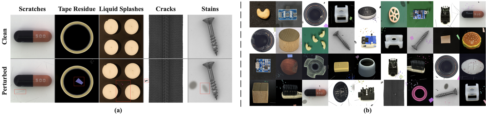

# ProAD
Official implementation of the paper:ProAD: Background-Robust Multi-class Anomaly Detection via Decoupled Perturbation Learning
## 1. Environments

Create a new conda environment and install required packages.

```
conda create -n ProAD python=3.8.12
conda activate ProAD
pip install -r requirements.txt
```
Experiments are conducted on NVIDIA GeForce RTX 3090 (24GB). Same GPU and package version are recommended. 

## 2. Prepare Datasets
./ refers to the current directory of the ProAD code, where datasets are stored by default. 
You can change this path, but ensure you update the data_path variable in the code accordingly.

### MVTec AD

Download the MVTec-AD dataset from [URL](https://www.mvtec.com/company/research/datasets/mvtec-ad).
Unzip the file to `./mvtec_anomaly_detection`.
```
|-- mvtec_anomaly_detection
    |-- bottle
    |-- cable
    |-- capsule
    |-- ....
```


### VisA

Download the VisA dataset from [URL](https://github.com/amazon-science/spot-diff).
Unzip the file to `./VisA/`. Preprocess the dataset to `./VisA_pytorch/` in 1-class mode by their official splitting 
[code](https://github.com/amazon-science/spot-diff).

You can also run the following command for preprocess.

```
python ./prepare_data/prepare_visa.py --split-type 1cls --data-folder ./VisA --save-folder ./VisA --split-file ./prepare_data/split_csv/1cls.csv
```
`../VisA_pytorch` will be like:
```
|-- VisA_pytorch
    |-- 1cls
        |-- candle
            |-- ground_truth
            |-- test
                    |-- good
                    |-- bad
            |-- train
                    |-- good
        |-- capsules
        |-- ....
```
 
### Real-IAD
Contact the authors of Real-IAD [URL](https://realiad4ad.github.io/Real-IAD/) to get the net disk link.

Download and unzip `realiad_512` and `realiad_jsons` in `./Real-IAD`.
`./Real-IAD` will be like:
```
|-- Real-IAD
    |-- audiokack
    |-- bottle_cap
    |-- ....
    |-- realiad_jsons
```
Data Preprocessing You need to use the provided preprocessing script to process the dataset. Run the following command in your terminal:

```
python ./prepare_data/prepare_Real-IAD.py --data_path ./Real-IAD --json_path ./Real-IAD/realiad_jsons
```

Note: The directory structure within ./Real-IAD will remain unchanged after the preprocessing is complete.

## 3. Model Training

### Object mask generation (MVANet)
On the first training run, object masks for the DcL mechanism are generated automatically by the
[MVANet](https://github.com/qianyu-dlut/MVANet) salient-object segmentation model (CVPR 2024, MIT License;
its inference code is vendored in `models/mvanet/`). The official trained weights (`Model_80.pth`) are
downloaded automatically to `./weights/MVANet/Model_80.pth` via gdown. If the automatic download fails,
download them manually from the official release
([Google Drive](https://drive.google.com/file/d/1_gabQXOF03MfXnf3EWDK1d_8wKiOemOv/view)) and place the file
at that path. Masks are saved to `<data_path>/<category>/train/mask/` as binary images
(white = object / black = background).

Note: the test-stage background-suite generation (Section 5) intentionally keeps using BiRefNet-HRSOD,
so the segmenter that defines the BG benchmarks is independent from the one used for training masks.

Multi-Class Setting
```
python ProAD_mvtec.py --data_path ./mvtec_anomaly_detection
```
```
python ProAD_visa.py --data_path ./VisA/1cls
```
```
python ProAD_realiad.py --data_path ./Real-IAD
```

## 4. Model Test
You can either retrain the model from scratch or use our pre-trained weights provided below for testing. To do so, unzip the files and place them into the `./checkpoints` folder.
### Trained model weights
| Dataset | Model | Download |
| :--- | :--- | :--- |
| MVTec-AD | DcL | [Google Drive](https://drive.google.com/file/d/1LxDGFcn8tjCIjuEoMo3Dgwjvf4oBNNwd/view?usp=sharing) |
| VisA | DcL | [Google Drive](https://drive.google.com/file/d/12U2aIkyxHrNK9QZ8q8UzhQnAdJXhBLRJ/view?usp=sharing) |
| Real-IAD | DcL | [Google Drive](https://drive.google.com/file/d/1jSlv6oB_s0fPJKXGoEAfkQ3r3qcJ_pD-/view?usp=sharing) |
```
python ProAD_mvtec_test.py --data_path ./mvtec_anomaly_detection --checkpoint_dir ./checkpoints
```
```
python ProAD_visa_test.py --data_path ./VisA/1cls --checkpoint_dir ./checkpoints
```
```
python ProAD_realiad_test.py --data_path ./Real-IAD --checkpoint_dir ./checkpoints
```


## 5. Background Interference Injection
To evaluate the robustness of our model against background variations, we provide the code for background interference injection.
The foreground/background partition of the BG suites is produced by BiRefNet-HRSOD (auto-downloaded from Hugging Face on first run),
which is independent from the MVANet segmenter used for training-stage mask generation. The results are shown below:


```
python background_noise_injector.py --dataset mvtec --root ./mvtec_anomaly_detection
```
```
python background_noise_injector.py --dataset visa --root ./VisA/1cls
```
```
python background_noise_injector.py --dataset realiad --root ./Real-IAD
```


